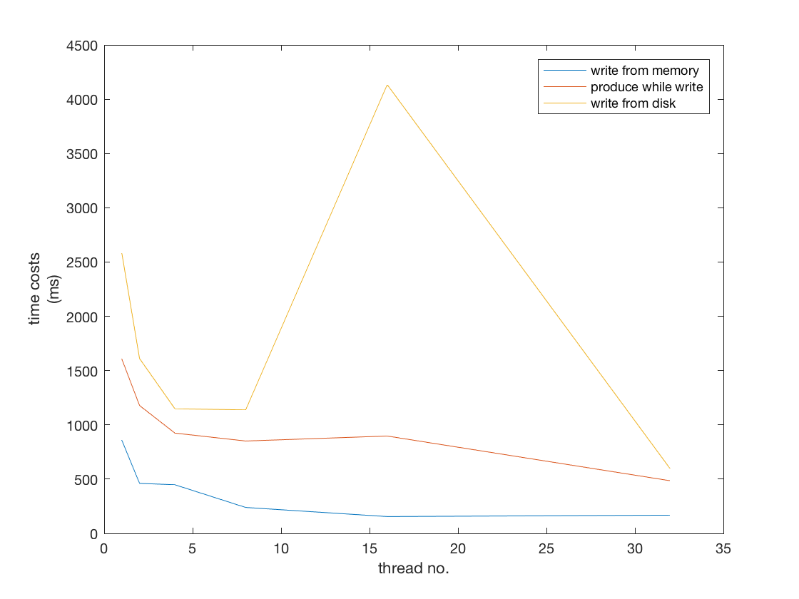
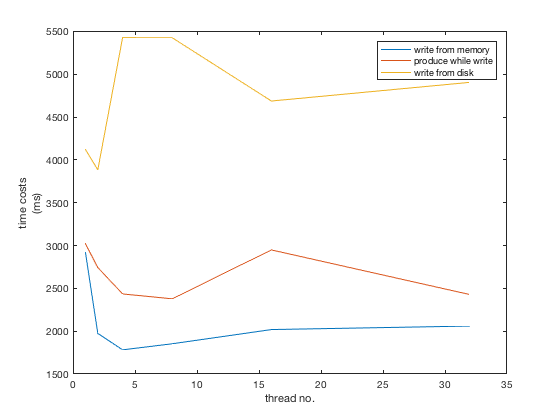
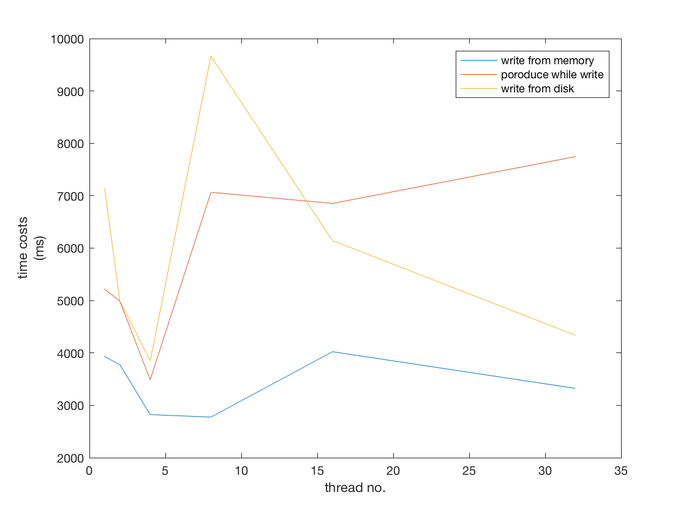
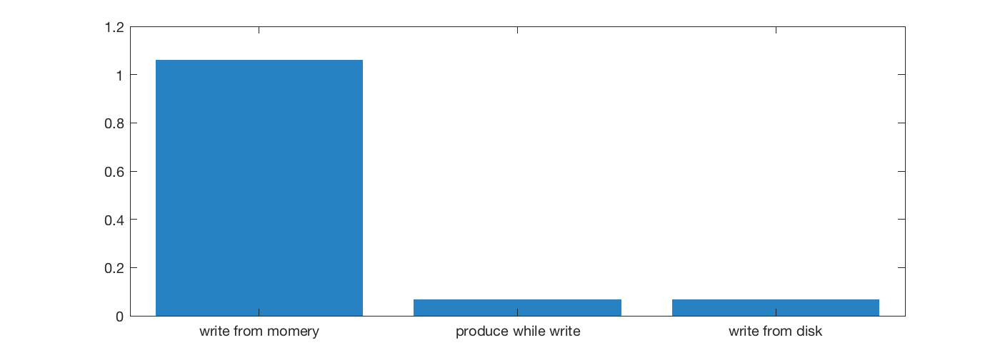

# Assignment #2 Report

Distributed System, Yang LI, 1452669

### Platform

- APFS in macOS 10.13.2
- HDFS 2.9.0 in Ubuntu 16.04.3
- Cassandra 3.11.1 in Ubuntu 16.04.3

## Problem I

I use three different strategies to write the integer array to the local file system(APFS), and the results are shown as follows.(sampled at ``1, 2, 4, 8, 16, 32`` thread(s))

In 4 threads Scenario(unit: *ms*):

> produceInMemory costs: 791
>
> produceInDisk costs: 1421
>
> writeFromMemory Thread_1 costs: 15
> writeFromMemory Thread_3 costs: 14
> writeFromMemory Thread_2 costs: 15
> writeFromMemory Thread_0 costs: 448
>
> produceWhileWrite Thread_1 costs: 1
> produceWhileWrite Thread_3 costs: 0
> produceWhileWrite Thread_2 costs: 0
> produceWhileWrite Thread_0 costs: 924
>
> writeFromDisk Thread_3 costs: 1140
> writeFromDisk Thread_1 costs: 1143
> writeFromDisk Thread_2 costs: 1144
> writeFromDisk Thread_0 costs: 1148

## Problem II

After packaging the jar and run in the serer, write strategy unchanged, the results are as following graph.

Since HDFS does not support random write, and thinking that multi-thread's function, so I have to use multi-thread to write file into many parts like map. And transfer almost 1G data costs to much, so I run in the server.

## Problem III

Since my strategy is same in three problem, so the memory costs and disk costs are simple, shows below.

